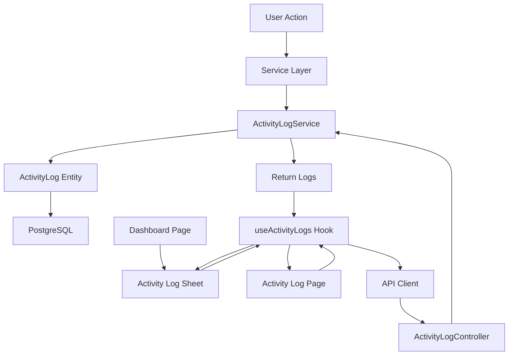

# Acti

vity Log System Implementation

## Overview

Create an activity logging system that tracks user actions across the application (todos, check-in/out, settings) and provides two frontend interfaces: a dedicated activity log page with date filtering, and a Sheet sidebar on the dashboard showing today's activity.

## Architecture



## Backend Implementation

### 1. Create ActivityLog Entity

**File:** `apps/api/src/modules/activity-logs/entities/activity-log.entity.ts`

- Fields: `id`, `userId`, `actionType` (enum), `entityType` (enum: TODO, CHECK_IN_OUT, USER_SETTINGS), `entityId` (nullable), `entityTitle` (nullable), `metadata` (JSONB for additional context), `createdAt`
- Use TypeORM decorators with proper column types

### 2. Create ActivityLog Module Structure

**Files to create:**

- `apps/api/src/modules/activity-logs/activity-logs.module.ts` - Module definition
- `apps/api/src/modules/activity-logs/activity-logs.service.ts` - Service with `createLog()` and `getLogsByUserAndDate()` methods
- `apps/api/src/modules/activity-logs/activity-logs.controller.ts` - Controller with GET endpoint for `/activity-logs?date=YYYY-MM-DD`
- `apps/api/src/modules/activity-logs/dto/create-activity-log.dto.ts` - DTO for creating logs
- `apps/api/src/modules/activity-logs/dto/get-activity-logs.dto.ts` - DTO for query params
- `apps/api/src/modules/activity-logs/enums/action-type.enum.ts` - Enum for action types (CREATE, UPDATE_COMPLETED, UPDATE_DUE_DATE, CHECK_IN, CHECK_OUT, UPDATE_SETTINGS)
- `apps/api/src/modules/activity-logs/enums/entity-type.enum.ts` - Enum for entity types

### 3. Integrate Logging into Existing Services

**File:** `apps/api/src/modules/todos/todos.service.ts`

- Inject `ActivityLogsService` in constructor
- Add logging in `create()` method: log CREATE action with todo title
- Add logging in `update()` method:
- If `completed` changed: log UPDATE_COMPLETED with before/after values
- If `dueDate` changed: log UPDATE_DUE_DATE with old/new dates

**File:** `apps/api/src/modules/check-in-out/check-in-out.service.ts`

- Inject `ActivityLogsService`
- Add logging in `checkIn()`: log CHECK_IN action
- Add logging in `checkOut()`: log CHECK_OUT action

**File:** `apps/api/src/modules/user-settings/user-settings.service.ts`

- Inject `ActivityLogsService`
- Add logging in `update()`: log UPDATE_SETTINGS action with changed fields

### 4. Register Module

**File:** `apps/api/src/app.module.ts`

- Import `ActivityLogsModule` into `AppModule`
- Add `ActivityLog` entity to TypeORM entities array

## Frontend Implementation

### 1. Create Activity Logs Hook

**File:** `apps/web-app/hooks/useActivityLogs.tsx`

- Use `useQuery` to fetch logs from `/activity-logs?date=YYYY-MM-DD`
- Accept optional date parameter (defaults to today)
- Return logs data, loading state, error state
- Auto-refresh when date changes

### 2. Create Activity Log Sheet Component

**File:** `apps/web-app/components/activity-log-sheet.tsx`

- Create Sheet component (using existing Sheet UI component)
- Display today's activity logs in a sidebar
- Include:
- Sheet header with "Today's Activity" title
- List of log entries with timestamps and action descriptions
- Empty state when no logs exist
- Loading skeleton while fetching
- Use icons/indicators for different action types
- Format timestamps in a readable format (e.g., "2 hours ago", "Just now")

### 3. Integrate Sheet into Dashboard

**File:** `apps/web-app/app/dashboard/page.tsx`

- Add state to control Sheet open/close
- Add button/trigger to open the activity log sheet (e.g., activity icon button in header area)
- Import and render `ActivityLogSheet` component
- Pass today's date to the hook

### 4. Create Activity Log Page

**File:** `apps/web-app/app/activity/page.tsx`

- Create new page component with date picker
- Use `Calendar` component (already exists in UI) for date selection
- Display logs in a list format with:
- Timestamp (formatted)
- Action type (human-readable)
- Entity title/description
- Action icon/indicator
- Group logs by time (e.g., "This morning", "This afternoon") or show chronologically
- Handle empty state when no logs exist

### 5. Create Activity Log UI Components

**File:** `apps/web-app/components/activity-log-item.tsx`

- Reusable component for displaying individual log entries
- Format timestamps, action types, and entity information
- Used by both Sheet and Activity Log page

### 6. Add Navigation

**File:** `apps/web-app/app/layout.tsx`

- Add link to activity log page in the header (for signed-in users)
- Or add to settings page navigation

## Data Flow

1. **Logging Flow:**

- User performs action (e.g., marks todo complete)
- Service method executes (e.g., `todosService.update()`)
- Service calls `activityLogsService.createLog()` with action details
- Log saved to database

2. **Dashboard Sidebar Flow:**

- User opens dashboard
- User clicks activity button/icon
- Sheet opens and `useActivityLogs(today)` hook fetches today's logs
- Logs displayed in Sheet sidebar

3. **Activity Page Flow:**

- User navigates to activity log page
- Page calls `useActivityLogs(date)` hook with selected date
- Hook makes API request to `/activity-logs?date=YYYY-MM-DD`
- Controller queries logs for user and date
- Logs returned and displayed

## Implementation Details

### Action Types to Log:

- `CREATE` - Todo created
- `UPDATE_COMPLETED` - Todo marked complete/incomplete
- `UPDATE_DUE_DATE` - Todo due date changed
- `CHECK_IN` - User checked in
- `CHECK_OUT` - User checked out
- `UPDATE_SETTINGS` - User settings updated

### Log Entry Structure:

```typescript
{
  id: string;
  userId: string;
  actionType: ActionType;
  entityType: EntityType;
  entityId?: string;
  entityTitle?: string;
  metadata?: Record<string, any>;
  createdAt: Date;
}
```

### Sheet Sidebar Design:

- Position: Right side (using Sheet's `side="right"` prop)
- Width: `sm:max-w-sm` (matches existing Sheet component)
- Trigger: Button with activity/clock icon in dashboard header area
- Content: Scrollable list of today's activity logs
- Auto-refresh: Consider polling or refetch on window focus for real-time updates

## Testing Considerations

- Verify logs are created for all tracked actions
- Test date filtering (today, past dates)
- Test Sheet open/close functionality
- Test empty states in both Sheet and page
- Verify user isolation (users only see their own logs)
- Test real-time updates when actions are performed

## Future Enhancements (Out of Scope)

- Log retention policies
- Export logs functionality
- Search/filter by action type
