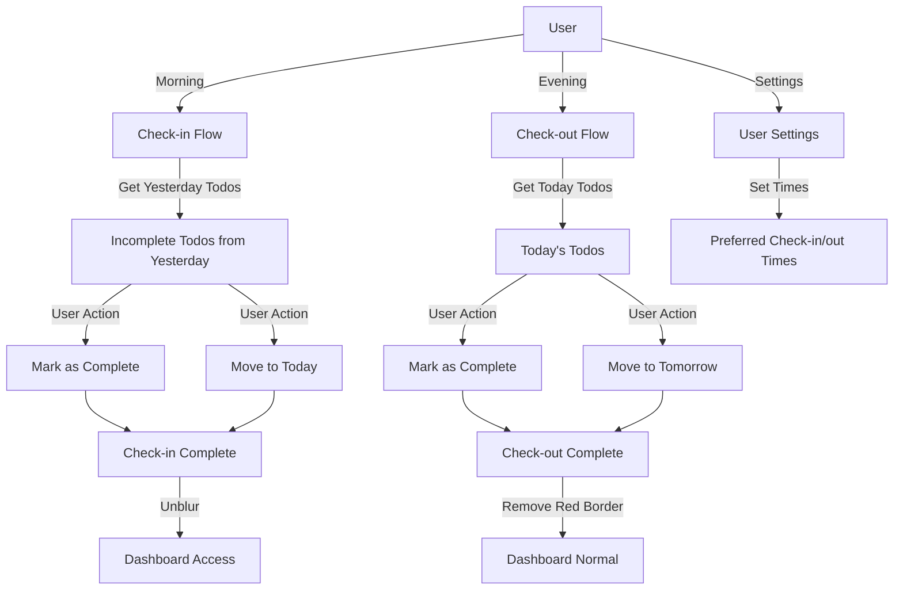

# Check-in/Check-out System Implementation Plan

## Overview

This plan implements a daily check-in/check-out workflow where users must review incomplete todos from the previous day during check-in and review current day todos during check-out. The dashboard is blurred until check-in is complete, and todos have red borders until check-out is complete.

## Architecture Flow

## Backend Implementation

### 1. Database Entities

#### CheckInOut Entity (`apps/api/src/modules/check-in-out/entities/check-in-out.entity.ts`)

- `id`: UUID primary key
- `userId`: string (Clerk user ID)
- `date`: Date (date of check-in/out, stored as date only)
- `checkInTime`: Date (timestamp of check-in)
- `checkOutTime`: Date (nullable, timestamp of check-out)
- `createdAt`: Date
- `updatedAt`: Date

#### UserSettings Entity (`apps/api/src/modules/user-settings/entities/user-settings.entity.ts`)

- `id`: UUID primary key
- `userId`: string (Clerk user ID, unique)
- `preferredCheckInTime`: string (time in HH:mm format, e.g., "08:00")
- `preferredCheckOutTime`: string (time in HH:mm format, e.g., "20:00")
- `createdAt`: Date
- `updatedAt`: Date

### 2. Check-in/Check-out Module

**Module Structure:**

- `apps/api/src/modules/check-in-out/check-in-out.module.ts`
- `apps/api/src/modules/check-in-out/check-in-out.service.ts`
- `apps/api/src/modules/check-in-out/check-in-out.controller.ts`
- `apps/api/src/modules/check-in-out/dto/check-in.dto.ts`
- `apps/api/src/modules/check-in-out/dto/check-out.dto.ts`
- `apps/api/src/modules/check-in-out/dto/check-status.dto.ts`

**Service Methods:**

- `checkIn(userId: string)`: Create check-in record for today, return incomplete todos from yesterday
- `checkOut(userId: string)`: Update check-out time for today, return incomplete todos from today
- `getCheckInStatus(userId: string, date: Date)`: Get check-in/check-out status for a date
- `hasCheckedInToday(userId: string)`: Boolean check
- `hasCheckedOutToday(userId: string)`: Boolean check
- `getIncompleteTodosFromYesterday(userId: string)`: Get todos from yesterday that are not completed
- `getIncompleteTodosFromToday(userId: string)`: Get todos from today that are not completed

**Controller Endpoints:**

- `POST /check-in-out/check-in`: Create check-in, returns incomplete todos from yesterday
- `POST /check-in-out/check-out`: Create/update check-out, returns incomplete todos from today
- `GET /check-in-out/status?date=YYYY-MM-DD`: Get check-in/check-out status for a date
- `GET /check-in-out/incomplete-yesterday`: Get incomplete todos from yesterday (for check-in flow)
- `GET /check-in-out/incomplete-today`: Get incomplete todos from today (for check-out flow)

### 3. User Settings Module

**Module Structure:**

- `apps/api/src/modules/user-settings/user-settings.module.ts`
- `apps/api/src/modules/user-settings/user-settings.service.ts`
- `apps/api/src/modules/user-settings/user-settings.controller.ts`
- `apps/api/src/modules/user-settings/dto/update-settings.dto.ts`

**Service Methods:**

- `getSettings(userId: string)`: Get or create default settings for user
- `updateSettings(userId: string, dto: UpdateSettingsDto)`: Update user settings

**Controller Endpoints:**

- `GET /user-settings`: Get current user's settings
- `PATCH /user-settings`: Update user's preferred check-in/check-out times

### 4. Todo Update Endpoint

**Update `apps/api/src/modules/todos/todos.controller.ts`:**

- `PATCH /todos/:id`: Update todo (mark complete, update dueDate)
- Add DTO: `apps/api/src/modules/todos/dto/update-todo.dto.ts`

**Update `apps/api/src/modules/todos/todos.service.ts`:**

- `update(id: string, userId: string, updateDto: UpdateTodoDto)`: Update todo with validation

### 5. Module Registration

Update `apps/api/src/app.module.ts`:

- Add `CheckInOutModule` and `UserSettingsModule` to imports
- Add `CheckInOut` and `UserSettings` entities to TypeORM entities array

## Frontend Implementation

### 1. Check-in/Check-out Components

#### Check-in Modal (`apps/web-app/components/check-in-modal.tsx`)

- Modal dialog using shadcn Dialog component
- Displays list of incomplete todos from yesterday
- For each todo: "Mark Complete" button and "Move to Today" button
- "Complete Check-in" button (disabled until all todos handled)
- Shows count of remaining todos

#### Check-out Modal (`apps/web-app/components/check-out-modal.tsx`)

- Similar structure to check-in modal
- Displays incomplete todos from today
- "Mark Complete" and "Move to Tomorrow" buttons
- "Complete Check-out" button

### 2. Dashboard Updates

**Update `apps/web-app/app/dashboard/page.tsx`:**

- Add overlay with blur effect when check-in not complete
- Add red border class to todo items when check-out not complete
- Check check-in status on mount
- Show check-in modal if not checked in
- Conditionally apply `border-red-500` class to todos if check-out not complete

### 3. Hooks

#### `apps/web-app/hooks/useCheckIn.tsx`

- `checkIn()`: Call check-in endpoint, return incomplete todos
- `getCheckInStatus(date?: Date)`: Get check-in/check-out status

#### `apps/web-app/hooks/useCheckOut.tsx`

- `checkOut()`: Call check-out endpoint, return incomplete todos
- `getCheckOutStatus(date?: Date)`: Get check-out status

#### `apps/web-app/hooks/useUpdateTodo.tsx`

- `updateTodo(id: string, updates: { completed?: boolean, dueDate?: Date })`: Update todo

#### `apps/web-app/hooks/useUserSettings.tsx`

- `getSettings()`: Fetch user settings
- `updateSettings(settings: { preferredCheckInTime?: string, preferredCheckOutTime?: string })`: Update settings

### 4. Settings Page

**Create `apps/web-app/app/settings/page.tsx`:**

- Form with time pickers for preferred check-in and check-out times
- Use shadcn Input or a time picker component
- Save button to update settings
- Display current settings

### 5. UI Enhancements

- Add blur overlay component using backdrop-filter CSS
- Add visual indicator (badge/icon) in header showing check-in/check-out status
- Add toast notifications for successful check-in/check-out
- Add loading states during API calls

## Data Flow

1. **Check-in Flow:**

- User visits dashboard → API checks if check-in complete for today
- If not, show check-in modal with incomplete todos from yesterday
- User marks todos complete or moves to today
- On "Complete Check-in", create check-in record, unblur dashboard

2. **Check-out Flow:**

- User clicks check-out button (or automatic prompt at preferred time)
- Show check-out modal with incomplete todos from today
- User marks todos complete or moves to tomorrow
- On "Complete Check-out", update check-out record, remove red borders

3. **Todo Movement:**

- When moving to today: set `dueDate` to today 23:59:59
- When moving to tomorrow: set `dueDate` to tomorrow 23:59:59
- Update todo via PATCH endpoint

## Validation Rules

- Check-in can only be done once per day
- Check-out can only be done once per day
- Check-out must be completed before next day's check-in (enforced in backend)
- Todos moved during check-in get today's date
- Todos moved during check-out get tomorrow's date

## Files to Create/Modify

### Backend

- `apps/api/src/modules/check-in-out/**` (new module)
- `apps/api/src/modules/user-settings/**` (new module)
- `apps/api/src/modules/todos/dto/update-todo.dto.ts` (new)
- `apps/api/src/modules/todos/todos.controller.ts` (modify - add PATCH)
- `apps/api/src/modules/todos/todos.service.ts` (modify - add update method)
- `apps/api/src/app.module.ts` (modify - register new modules/entities)

### Frontend

- `apps/web-app/components/check-in-modal.tsx` (new)
- `apps/web-app/components/check-out-modal.tsx` (new)
- `apps/web-app/hooks/useCheckIn.tsx` (new)
- `apps/web-app/hooks/useCheckOut.tsx` (new)
- `apps/web-app/hooks/useUpdateTodo.tsx` (new)