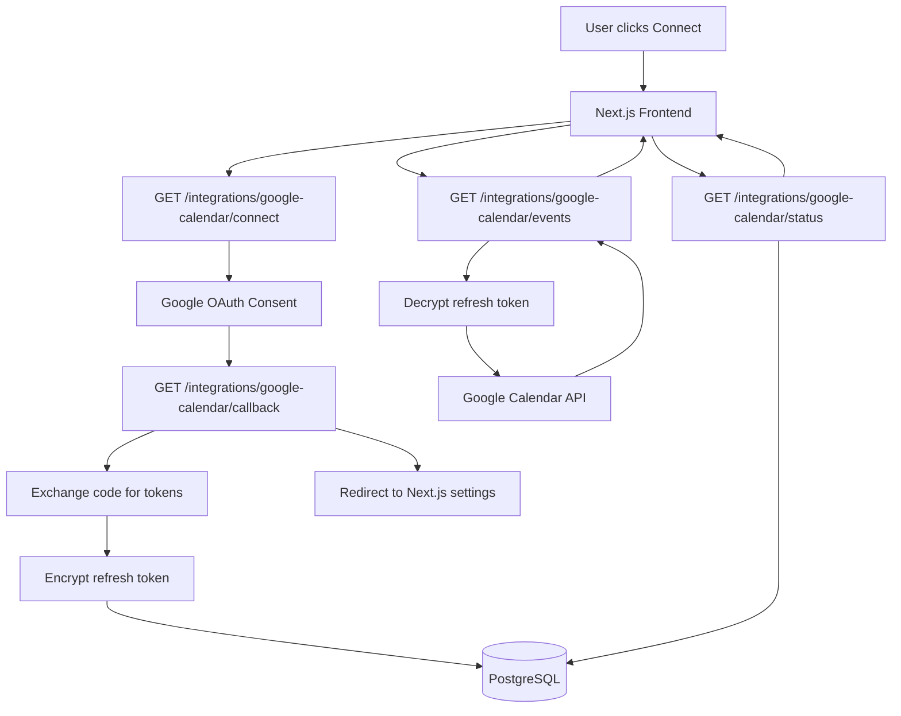

# Google Calendar

Integration Implementation Plan

## Architecture Overview

The implementation will follow the existing module pattern in the NestJS backend and integrate with the Next.js frontend using React Query hooks. All OAuth flows and token management will be server-side only.

## Implementation Steps

### 1. Backend: Dependencies & Configuration

**File: `apps/api/package.json`**

- Add `googleapis` package for Google Calendar API
- Add `jsonwebtoken` for state parameter signing

**File: `apps/api/src/app.module.ts`**

- Register new `IntegrationsModule` in imports
- Add `OAuthIntegration` entity to TypeORM entities array

**Environment Variables** (add to `.env.local` and document):

- `GOOGLE_CLIENT_ID`
- `GOOGLE_CLIENT_SECRET`
- `GOOGLE_OAUTH_REDIRECT_URI` (e.g., `http://localhost:3000/integrations/google-calendar/callback`)
- `APP_WEB_URL` (e.g., `http://localhost:3001`)
- `INTEGRATION_TOKEN_ENCRYPTION_KEY` (32-byte base64 encoded key)
- `JWT_SECRET` (for state parameter signing)

### 2. Backend: Data Model

**File: `apps/api/src/modules/integrations/entities/oauth-integration.entity.ts`**

- Create entity with:
- `id` (UUID primary key)
- `userId` (string, indexed)
- `provider` (enum: `google_calendar`)
- `refreshTokenEncrypted` (text, nullable)
- `scopes` (string array or JSONB)
- `connectedAt` (timestamp)
- `updatedAt` (timestamp)
- Add unique constraint on `[userId, provider]`

**File: `apps/api/src/modules/integrations/enums/integration-provider.enum.ts`**

- Create enum: `GOOGLE_CALENDAR = 'google_calendar'`

### 3. Backend: Token Encryption Utility

**File: `apps/api/src/modules/integrations/utils/token-encryption.util.ts`**

- Implement `encryptToken(token: string, key: string): string`
- Implement `decryptToken(encryptedToken: string, key: string): string`
- Use Node.js `crypto` module with AES-256-GCM
- Include IV and auth tag in encrypted output
- Add error handling for decryption failures

### 4. Backend: OAuth Service

**File: `apps/api/src/modules/integrations/services/google-calendar-oauth.service.ts`**

- `getAuthUrl(userId: string): string`
- Generate JWT state token with userId, nonce, expiry
- Build Google OAuth URL with `access_type=offline`, `prompt=consent`
- Include scopes: `calendar.events.readonly`
- `handleCallback(userId: string, code: string, state: string): Promise<void>`
- Validate JWT state token
- Exchange code for tokens using `googleapis` OAuth2Client
- Extract and encrypt refresh token
- Upsert `OAuthIntegration` record
- `getClientForUser(userId: string): Promise<OAuth2Client>`
- Load integration record
- Decrypt refresh token
- Create and configure OAuth2Client with refresh token
- Return client ready for API calls
- `getStatus(userId: string): Promise<{ connected: boolean; scopes: string[] }>`
- `disconnect(userId: string): Promise<void>`
- Delete integration record
- Optionally revoke refresh token via Google API

### 5. Backend: Calendar Service

**File: `apps/api/src/modules/integrations/services/google-calendar.service.ts`**

- `listEvents(userId: string, timeMin: Date, timeMax: Date, maxResults?: number): Promise<CalendarEvent[]>`
- Get OAuth2Client for user
- Call `calendar.events.list` via googleapis
- Normalize and return events
- Handle token refresh automatically (googleapis handles this)
- Map Google API errors to appropriate HTTP exceptions

### 6. Backend: Controller

**File: `apps/api/src/modules/integrations/controllers/google-calendar.controller.ts`**

- `GET /integrations/google-calendar/connect`
- Use `@CurrentUser()` decorator
- Call `getAuthUrl()` and redirect
- Mark as `@Public()` to allow redirect (or handle auth differently)
- `GET /integrations/google-calendar/callback`
- Extract `code` and `state` from query params
- Validate state, extract userId
- Call `handleCallback()`
- Redirect to `APP_WEB_URL + "/settings/integrations?googleCalendar=connected"`
- Mark as `@Public()` (or handle auth via state token)
- `GET /integrations/google-calendar/status`
- Return connection status and scopes
- `POST /integrations/google-calendar/disconnect`
- Call `disconnect()` service method
- `GET /integrations/google-calendar/events`
- Query params: `timeMin`, `timeMax`, `maxResults`
- Call calendar service `listEvents()`
- Return normalized events

**File: `apps/api/src/modules/integrations/dto/list-events.dto.ts`**

- Create DTO with validation for query parameters

### 7. Backend: Module Setup

**File: `apps/api/src/modules/integrations/integrations.module.ts`**

- Import `TypeOrmModule.forFeature([OAuthIntegration])`
- Register services and controllers
- Export services if needed by other modules

### 8. Frontend: API Client Hook

**File: `apps/web-app/hooks/useGoogleCalendar.tsx`**

- `useGoogleCalendarStatus()` - Query hook for connection status
- `useGoogleCalendarEvents(timeMin, timeMax)` - Query hook for events
- `useDisconnectGoogleCalendar()` - Mutation hook for disconnect
- Follow pattern from `useUserSettings.tsx`

### 9. Frontend: Settings Page Integration

**File: `apps/web-app/app/settings/page.tsx`**

- Add "Integrations" section
- Display Google Calendar connection status
- Show "Connect" button (links to backend `/integrations/google-calendar/connect`)
- Show "Disconnect" button if connected
- Display success toast after callback redirect

**Optional: Create separate integrations page:**

- `apps/web-app/app/settings/integrations/page.tsx` (if preferred)

### 10. Frontend: Calendar Events Display (Optional MVP)

**File: `apps/web-app/components/google-calendar-events.tsx`**

- Component to display calendar events
- Use `useGoogleCalendarEvents()` hook
- Show events in a list or calendar view
- Handle loading and error states

## Security Considerations

1. **State Parameter**: JWT signed with secret, includes userId, nonce, and 10-minute expiry
2. **Token Storage**: Refresh tokens encrypted at rest using AES-256-GCM
3. **Logging**: Never log tokens, auth codes, or full callback URLs
4. **Error Handling**: Map Google API errors appropriately (invalid_grant → reconnect required)
5. **CSRF**: State parameter validation prevents CSRF attacks

## Testing Checklist

- [ ] Connect flow: User can initiate OAuth and complete callback
- [ ] Token storage: Refresh token encrypted and stored correctly
- [ ] Status endpoint: Returns correct connection state
- [ ] Events listing: Can fetch and display calendar events
- [ ] Token refresh: Access token refresh works automatically
- [ ] Disconnect: Removes tokens and updates status
- [ ] Error handling: Handles revoked tokens, missing refresh tokens

## Files to Create/Modify

### New Files:

- `apps/api/src/modules/integrations/entities/oauth-integration.entity.ts`
- `apps/api/src/modules/integrations/enums/integration-provider.enum.ts`
- `apps/api/src/modules/integrations/utils/token-encryption.util.ts`
- `apps/api/src/modules/integrations/services/google-calendar-oauth.service.ts`
- `apps/api/src/modules/integrations/services/google-calendar.service.ts`
- `apps/api/src/modules/integrations/controllers/google-calendar.controller.ts`
- `apps/api/src/modules/integrations/dto/list-events.dto.ts`