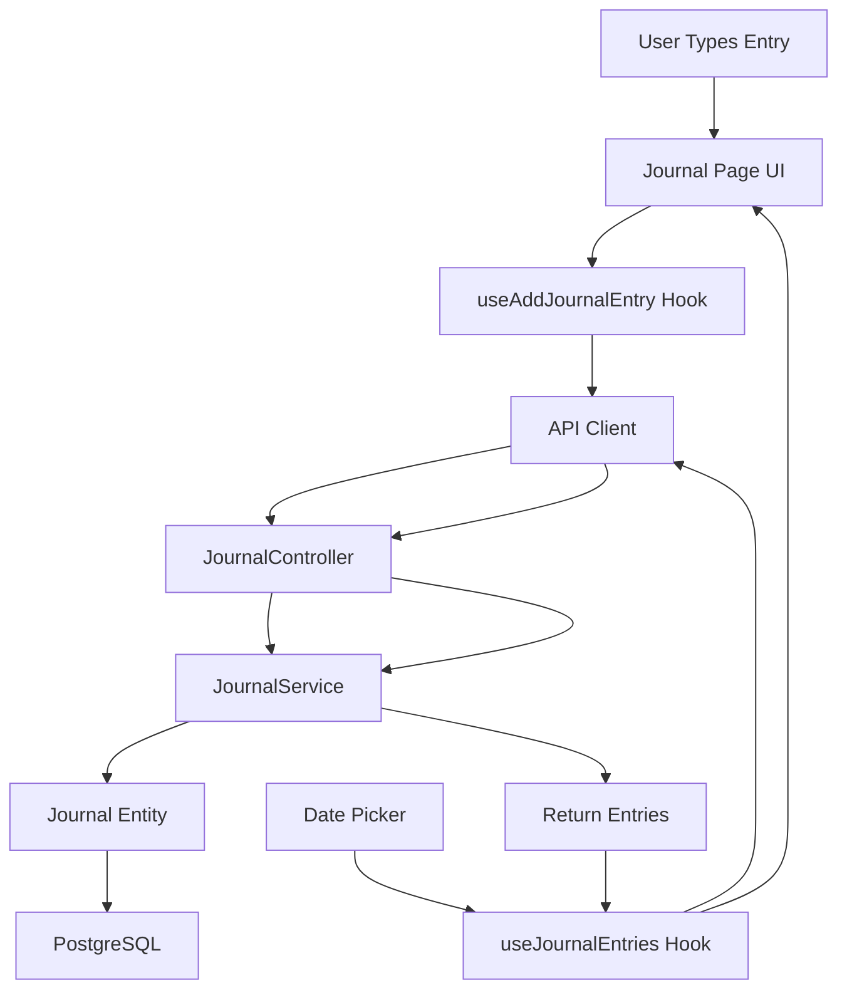

#Journal Feature Implementation

## Overview

Create a minimal, notepad-like Journal feature that allows users to add multiple text entries per day. The UI will use a handwritten font style and provide a date picker to view entries from any date.

## Architecture



## Backend Implementation

### 1. Create Journal Entity

**File:** `apps/api/src/modules/journal/entities/journal.entity.ts`

- Fields: `id` (UUID, primary key), `userId` (string), `description` (text), `date` (date, timestamptz), `createdAt` (timestamptz), `deletedAt` (timestamptz, nullable, soft delete)
- Use TypeORM decorators with proper column types
- Index on `userId` and `date` for query performance

### 2. Create Journal Module Structure

**Files to create:**

- `apps/api/src/modules/journal/journal.module.ts` - Module definition
- `apps/api/src/modules/journal/journal.service.ts` - Service with `create()`, `findByUserAndDate()`, and `delete()` methods
- `apps/api/src/modules/journal/journal.controller.ts` - Controller with:
- POST `/journal` - Create journal entry
- GET `/journal?date=YYYY-MM-DD` - Get entries for a date
- DELETE `/journal/:id` - Soft delete entry
- `apps/api/src/modules/journal/dto/create-journal.dto.ts` - DTO for creating entries
- `apps/api/src/modules/journal/dto/get-journal.dto.ts` - DTO for query params

### 3. Register Module

**File:** `apps/api/src/app.module.ts`

- Import `JournalModule` into `AppModule`
- Add `Journal` entity to TypeORM entities array

## Frontend Implementation

### 1. Create Journal Hooks

**File:** `apps/web-app/hooks/useJournalEntries.tsx`

- Use `useQuery` to fetch entries from `/journal?date=YYYY-MM-DD`
- Accept optional date parameter (defaults to today)
- Return entries data, loading state, error state

**File:** `apps/web-app/hooks/useAddJournalEntry.tsx`

- Use `useMutation` to create journal entries
- Accept description and date
- Invalidate journal queries on success

### 2. Create Journal Page

**File:** `apps/web-app/app/journal/page.tsx`

- Create new page component with:
- Date picker (using existing Calendar component) on the right side
- Main content area on the left with:
  - Input area at the top (notepad-style textarea)
  - List of journal entries below
  - Empty state when no entries
- Handwritten font applied to textarea and entries
- Minimal, clean design

### 3. Create Journal UI Components

**File:** `apps/web-app/components/journal-entry.tsx`

- Component for displaying individual journal entries
- Use handwritten font
- Show timestamp (formatted as "time ago")
- Minimal styling

**File:** `apps/web-app/components/journal-input.tsx` (Optional)

- Reusable textarea component with handwritten font
- Auto-resize or fixed height
- Placeholder text

### 4. Add Navigation

**File:** `apps/web-app/app/layout.tsx`

- Add link to journal page in the header (for signed-in users)
- Place it next to Activity and Settings links

### 5. Font Configuration

- Use a handwritten font (e.g., "Kalam", "Caveat", "Dancing Script", or "Indie Flower" from Google Fonts)
- Apply font to journal textarea and entries
- Configure in `app/layout.tsx` or use CSS classes

## Design Details

### Journal Page Layout:

- Left side (main): Input area + entries list
- Right side: Calendar for date selection
- Input area: Large textarea with handwritten font, placeholder "Write your thoughts..."
- Entries: Displayed in reverse chronological order (newest first)
- Each entry: Description text with small timestamp below

### Font Selection:

- Recommended: "Kalam" or "Caveat" from Google Fonts (clean, readable handwritten style)
- Alternative: "Dancing Script" or "Indie Flower"
- Apply via CSS class or Next.js font configuration

### Styling:

- Minimal borders and shadows
- Soft background colors
- Spacious padding
- Clean typography hierarchy

## Data Flow

1. **Create Entry Flow:**

- User types in textarea
- User submits (Enter key or button)
- `useAddJournalEntry` hook called
- POST request to `/journal` with description and date
- Backend creates entry with current date (or selected date)
- Entry appears in list

2. **View Entries Flow:**

- User navigates to `/journal` or selects date
- `useJournalEntries(date)` hook fetches entries
- GET request to `/journal?date=YYYY-MM-DD`
- Entries displayed in chronological order

3. **Delete Entry Flow:**

- User clicks delete (if implemented in future)
- DELETE request to `/journal/:id`
- Backend soft deletes (sets deletedAt)
- Entry removed from list

## Implementation Details

### Journal Entry Structure:

```typescript
{
  id: string;
  userId: string;
  description: string;
  date: Date;
  createdAt: Date;
  deletedAt: Date | null;
}
```

### API Endpoints:

- `POST /journal` - Create entry
- Body: `{ description: string, date?: string }` (date optional, defaults to today)
- `GET /journal?date=YYYY-MM-DD` - Get entries for date
- `DELETE /journal/:id` - Soft delete entry (for future use)

## Testing Considerations

- Verify entries are created with correct date
- Test date filtering (today, past dates)
- Test empty states
- Verify user isolation (users only see their own entries)
- Test with multiple entries per day

## Future Enhancements (Out of Scope)

- Edit entries
- Rich text formatting
